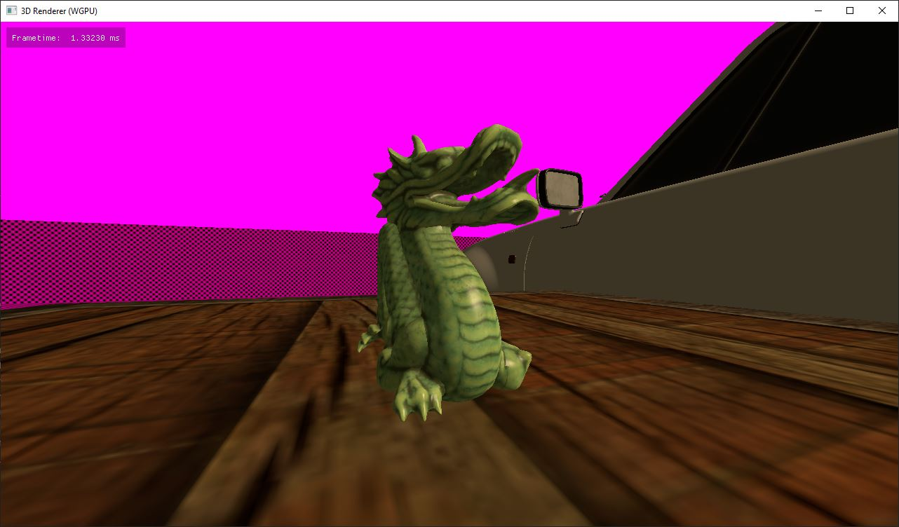

# WGPU Renderer

Yes, this is yet another renderer to add to my list of renderers, which, as of
writing, includes Vulkan, OpenGL, and Direct3D11.

Except, this one is written in Zig, and is, by the nature of WebGPU, fully
cross-platform for no extra effort.

Zig's toolchain is also very easy to set up, so even development is
cross-platform. (That is, if and when I figure out how to get all the non-Zig
dependencies to cross-compile cleanly.)

# Details

## Design

- Right-handed world space coordinate system like Vulkan clip space (+Z forward, -Y up)
- Reversed Z buffer with infinite far plane
- glTF binary meshes
- KTX2 textures
    - BC7 (SDR diffuse + specular)
    - BC6H (HDR base color)
    - BC4u (monochrome)

## Preview


# Development

## Requirements

| Tool | Version                                            |
|------|----------------------------------------------------|
| Zig  | `>=0.14.0`                                         |
| Rust | `>=1.80.1` (not sure what the minimum required is) |

## Setting Up

```
git clone --recursive https://github.com/arctic-marmoset/wgpu-renderer.git
cd wgpu-renderer
zig build
```

# Third-Party

- [cglm](https://github.com/recp/cglm)
- [GLFW (ported to Zig build system)](https://github.com/slimsag/glfw)
- [imgui](https://github.com/ocornut/imgui)
    - C bindings provided by [dear_bindings](https://github.com/dearimgui/dear_bindings)
- [libktx](https://github.com/KhronosGroup/KTX-Software)
- [wgpu-native [v0.19.4.1]](https://github.com/gfx-rs/wgpu-native)
- [zgltf](https://github.com/kooparse/zgltf)

With [Zig to Rust target conversion code](extern/wgpu-native/build-src/rust.zig)
modified from [build.crab](https://github.com/akarpovskii/build.crab).
